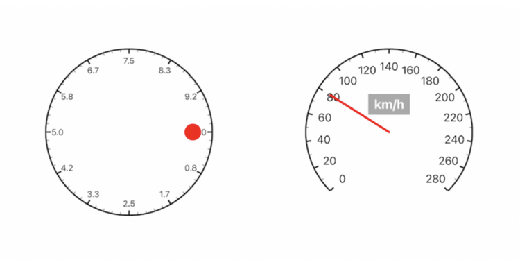

# Knob

A knob UIControl in Swift.



## Usage

### Initialization

```swift
let knob = Knob(frame: CGRect(x: (view.bounds.width - 240) / 2,
                              y: (view.bounds.height - 240) / 2,
                              width: 240,
                              height: 240))
view.addSubview(knob)
```

### Action

- set value

```swift
knob.setValue(targetValue, animated: true)
```

- add target

```swift
knob.addTarget(self, action: #selector(ViewController.handleValueChanged(_:)), for: .valueChanged)
```

- handle value changed

```swift
@objc func handleValueChanged(_ sender: Knob) {
    print("value: \(sender.value)")
}
```

### Configuration

- value range

```swift
knob.minimumValue = 0
knob.maximumValue = 260
```

- angle range

```swift
knob.startAngle = -CGFloat.pi * 5 / 4
knob.endAngle = CGFloat.pi / 4
```

- graduations

```swift
knob.graduations = 26
knob.largeGraduations = 13
```

- value dispaly

```swift
knob.valueDisplay = .forLargeGraduation
knob.valueAttributes = [.foregroundColor: UIColor.black, .font: UIFont.systemFont(ofSize: 16) ]
knob.valueFormatter = { "\(Int($0))" }
```

- indicator type

```swift
knob.indicatorType = .pointer(color: .red, length: 100, width: 4)
```

- other configurations

```swift
knob.isEnableFeedback = true
knob.isGraduationsAligned = true
knob.isContinuous = true
```


## Features

- [x] Multiple indicators
- [x] Controlled Angle Range
- [x] Display Graduations
- [x] Support Storyboard
- [ ] Custom indicator layer

## Requirements

- iOS 10.0+
- Swift 5.0+

## Installation

### CocoaPods

```ruby
pod 'Knob', '~> 0.0.1'
```

### Swift Package Manager

```swift
dependencies: [
    .package(url: "https://github.com/dongyaxun/Knob.git", .upToNextMajor(from: "0.0.1"))
]
```

## License

Knob is released under the MIT license. See [LICENSE](./LICENSE) for details.
